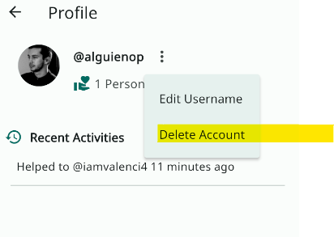

# How to Delete Your Account in Ministrar App

## Table of Contents

1. [Introduction](#introduction)
2. [Steps](#steps)
3. [Warning](#warning)

## Introduction 

This guide will walk you through the steps to delete your account.

## Steps 

1. Navigate to your profile.
2. Tap on the 3 dots icon.
3. Select "Delete Account" from the dropdown menu.
4. Confirm the action.
   - A popup will appear asking you to confirm the deletion of your account. Tap "Yes" to proceed.

## Warning 

> **Note:** This will remove all your data related to your account. Please ensure you have saved any important data before proceeding.
